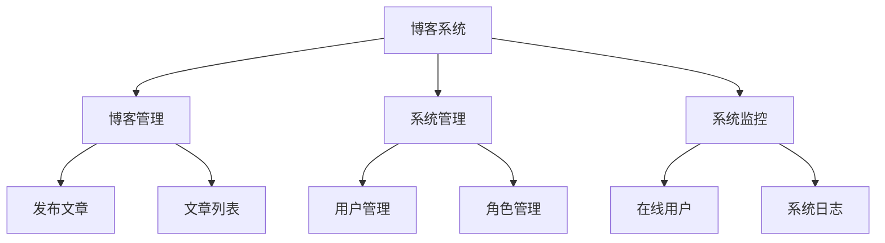

# BootDo Blog System

基于 BootDo 开源项目进行二次开发的个人博客系统，用于软件工程敏捷开发与 DevOps 实践。

## 技术栈

- Spring Boot
- MyBatis
- MySQL
- Thymeleaf
- Maven

## 项目功能

- 用户登录
- 文章发布
- 文章管理
- 用户管理
- 系统日志

````markdown

## 敏捷开发工作项


## 敏捷开发需求规划

本项目基于 BootDo 博客系统进行二次开发。在本地部署与初步测试过程中，结合博客系统的实际使用场景，整理出以下可新增或改进的功能，并按照敏捷开发方式进行 Story 拆分和迭代规划。

### 候选功能列表

| 编号 | 功能名称 | 功能说明 | 优先级 | 难度 |
|---|---|---|---|---|
| 1 | 博客前台登录状态显示 | 已登录用户访问博客前台时，右上角显示当前用户名，而不是继续显示“登录” | 高 | 低-中 |
| 2 | 交流页面内容完善 | 前台“交流”页面目前内容较少，补充交流说明、反馈方式或留言引导 | 高 | 低 |
| 3 | 文章搜索功能 | 用户可以通过关键词搜索文章标题或内容，快速定位感兴趣的文章 | 高 | 中 |
| 4 | 文章浏览量统计 | 用户访问文章详情页时，系统自动记录浏览量，并在页面展示阅读量 | 中 | 中 |
| 5 | 热门文章排行 | 根据文章浏览量或点赞数展示热门文章列表，方便用户快速浏览高热度内容 | 中 | 中 |
| 6 | 文章点赞功能 | 用户可以对喜欢的文章进行点赞，页面展示文章点赞数量 | 中 | 中 |

---

## Story 拆分

### Story 1：博客前台登录状态显示

**用户故事：**

作为已登录用户，  
我希望访问博客前台页面时能够看到当前用户名，  
以便确认系统已经识别我的登录状态，而不是继续显示“登录”。

**验收标准：**

1. 未登录用户访问博客前台时，右上角仍显示“登录”。
2. 已登录用户访问博客前台时，右上角显示当前用户名。
3. 登录状态显示不影响原有后台登录和退出功能。
4. 页面样式与原博客导航栏保持一致。

**优先级：高**  
**重要程度：关键**  
**预计工时：1 人天**

---

### Story 2：交流页面内容完善

**用户故事：**

作为博客访问者，  
我希望点击“交流”页面后能够看到明确的交流说明和互动入口，  
以便知道如何与博主或系统维护者进行反馈与交流。

**验收标准：**

1. 点击前台导航栏“交流”后，页面不再为空。
2. 页面展示交流说明、留言提示或联系方式。
3. 页面内容与博客主题风格保持一致。
4. 不影响原有首页、关于、登录等导航功能。

**优先级：高**  
**重要程度：重要**  
**预计工时：1 人天**

---

### Story 3：文章搜索功能

**用户故事：**

作为博客访问者，  
我希望能够通过关键词搜索文章，  
以便快速找到自己感兴趣的内容。

**验收标准：**

1. 博客首页提供搜索输入框。
2. 输入关键词后，可以按文章标题或内容查询文章。
3. 搜索结果能够正常展示文章标题、作者和发布时间。
4. 没有搜索结果时，页面给出友好提示。

**优先级：高**  
**重要程度：重要**  
**预计工时：2 人天**

---

### Story 4：文章浏览量统计

**用户故事：**

作为博客访问者，  
我希望文章页面能够显示阅读量，  
以便了解文章的受关注程度。

**验收标准：**

1. 用户访问文章详情页时，文章浏览量自动增加。
2. 文章详情页显示当前浏览量。
3. 浏览量数据能够保存到数据库中。
4. 多次访问后浏览量能够正确变化。

**优先级：中**  
**重要程度：重要**  
**预计工时：2 人天**

---

### Story 5：热门文章排行

**用户故事：**

作为博客访问者，  
我希望能够看到热门文章排行，  
以便快速浏览当前最受关注的文章。

**验收标准：**

1. 博客首页或侧边栏显示热门文章列表。
2. 热门文章根据浏览量或点赞数排序。
3. 点击热门文章标题可以进入文章详情页。
4. 热门文章列表显示数量合理，例如 Top 5。

**优先级：中**  
**重要程度：一般**  
**预计工时：2 人天**

---

### Story 6：文章点赞功能

**用户故事：**

作为博客访问者，  
我希望能够给喜欢的文章点赞，  
以便表达对文章内容的认可。

**验收标准：**

1. 文章详情页显示点赞按钮。
2. 用户点击点赞后，点赞数增加。
3. 页面能够显示当前文章点赞数量。
4. 点赞功能不影响文章详情页正常访问。

**优先级：中**  
**重要程度：一般**  
**预计工时：2 人天**

---

## 迭代规划

### 迭代 1：博客前台体验优化

**迭代目标：**

优化博客前台页面的基础体验，解决登录状态显示不一致、交流页面内容不足、文章查找不方便等问题，使博客前台更完整、更易用。

**迭代周期：**

2026/05/12 - 2026/05/18

**包含 Story：**

| Story | 功能名称 | 优先级 | 预计工时 |
|---|---|---|---|
| Story 1 | 博客前台登录状态显示 | 高 | 1 人天 |
| Story 2 | 交流页面内容完善 | 高 | 1 人天 |
| Story 3 | 文章搜索功能 | 高 | 2 人天 |

**迭代验收目标：**

1. 已登录用户访问博客前台时能够看到当前用户名。
2. “交流”页面具有明确内容，不再为空页面。
3. 用户可以通过关键词搜索文章。
4. 修改内容通过本地部署验证。
5. 代码提交到 GitHub 后，GitHub Actions 自动构建通过。

---

### 迭代 2：文章互动与热度统计

**迭代目标：**

增强博客文章的互动能力和内容反馈能力，使用户能够了解文章热度，并通过点赞等方式进行简单互动。

**迭代周期：**

2026/05/19 - 2026/05/25

**包含 Story：**

| Story | 功能名称 | 优先级 | 预计工时 |
|---|---|---|---|
| Story 4 | 文章浏览量统计 | 中 | 2 人天 |
| Story 5 | 热门文章排行 | 中 | 2 人天 |
| Story 6 | 文章点赞功能 | 中 | 2 人天 |

**迭代验收目标：**

1. 文章详情页能够显示浏览量。
2. 用户访问文章后浏览量能够自动增加。
3. 博客首页能够展示热门文章排行。
4. 文章详情页支持点赞并显示点赞数量。
5. 修改内容通过本地部署验证。
6. 代码提交到 GitHub 后，GitHub Actions 自动构建通过。

---

## 分支开发计划

本项目采用功能分支开发方式，不直接在 `main` 分支上进行功能开发。每个功能从 `main` 分支创建独立的 feature 分支，开发完成并验证后再合并回 `main`。

| 功能 | 分支名称 | 说明 |
|---|---|---|
| 博客前台登录状态显示 | `feature-blog-user-status` | 优化前台导航栏登录状态展示 |
| 交流页面内容完善 | `feature-communication-page` | 完善博客前台交流页面内容 |
| 文章搜索功能 | `feature-article-search` | 增加博客文章搜索能力 |
| 文章浏览量统计 | `feature-article-views` | 增加文章浏览量记录与展示 |
| 热门文章排行 | `feature-hot-articles` | 根据浏览量或点赞数展示热门文章 |
| 文章点赞功能 | `feature-article-like` | 增加文章点赞交互功能 |
