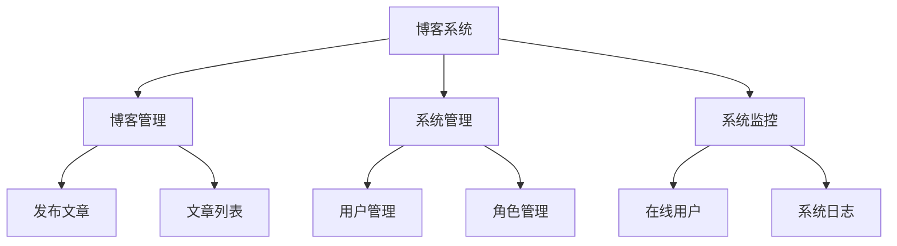
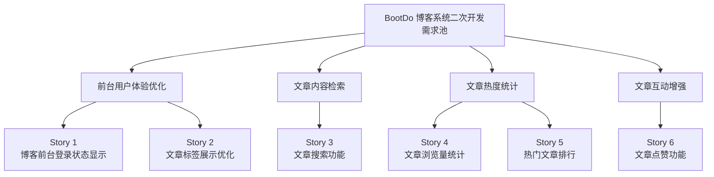
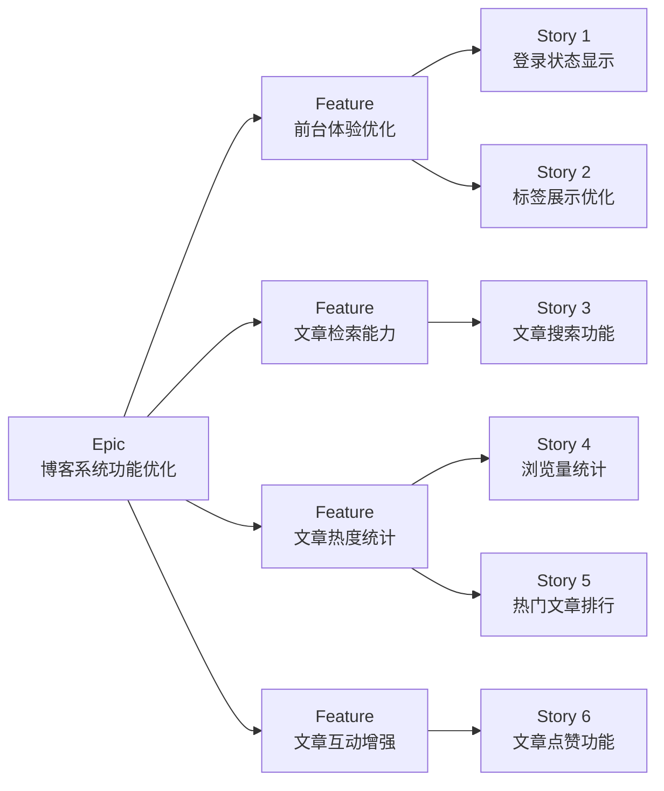
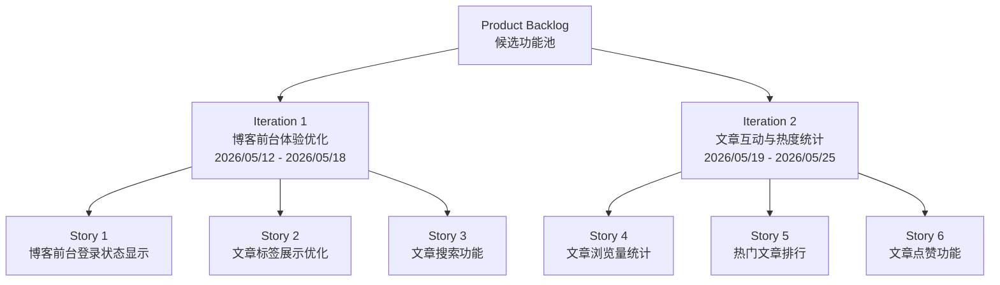
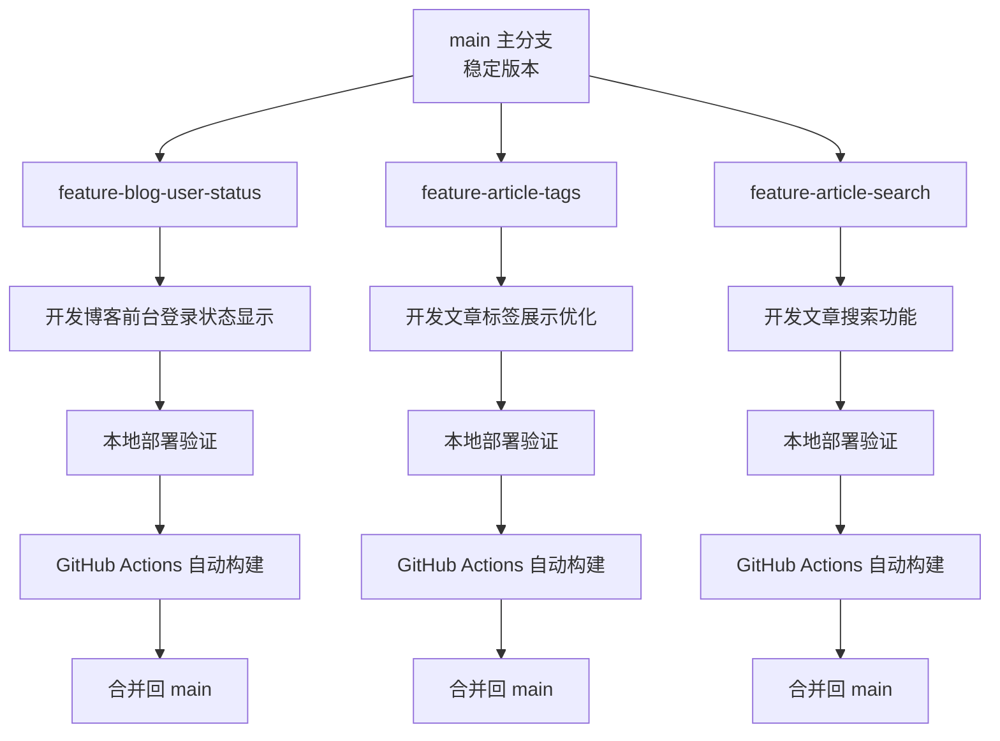

# BootDo Blog System

基于 BootDo 开源项目进行二次开发的个人博客系统，用于软件工程敏捷开发与 DevOps 实践。

## 技术栈

- Spring Boot
- MyBatis
- MySQL
- Thymeleaf
- Maven
- GitHub Actions

## 项目功能

- 用户登录
- 文章发布
- 文章管理
- 用户管理
- 系统日志

## 敏捷开发工作项



## 敏捷开发需求规划

本项目基于 BootDo 博客系统进行二次开发。在本地部署与初步测试过程中，结合博客系统的实际使用场景，整理出以下可新增或改进的功能，并按照敏捷开发方式进行 Story 拆分和迭代规划。

### 需求池规划图



### 候选功能列表

| 编号 | 功能名称 | 功能说明 | 优先级 | 难度 |
|---|---|---|---|---|
| 1 | 博客前台登录状态显示 | 已登录用户访问博客前台时，右上角显示当前用户名，而不是继续显示“登录” | 高 | 低-中 |
| 2 | 文章标签展示优化 | 在博客文章列表或详情页展示文章标签，帮助用户快速了解文章主题 | 高 | 低-中 |
| 3 | 文章搜索功能 | 用户可以通过关键词搜索文章标题或正文内容，快速定位感兴趣的文章 | 高 | 中 |
| 4 | 文章浏览量统计 | 用户访问文章详情页时，系统自动记录浏览量，并在页面展示阅读量 | 中 | 中 |
| 5 | 热门文章排行 | 根据文章浏览量或点赞数展示热门文章列表，方便用户快速浏览高热度内容 | 中 | 中 |
| 6 | 文章点赞功能 | 用户可以对喜欢的文章进行点赞，页面展示文章点赞数量 | 中 | 中 |

---

## Story 拆分

### Story 规划关系图



### Story 详情表

| Story | 功能名称 | 用户故事 | 验收标准 | 优先级 | 重要程度 | 预计工时 |
|---|---|---|---|---|---|---|
| Story 1 | 博客前台登录状态显示 | 作为已登录用户，我希望访问博客前台页面时能够看到当前用户名，以便确认系统已经识别我的登录状态，而不是继续显示“登录”。 | 未登录用户访问博客前台时，右上角仍显示“登录”；已登录用户访问博客前台时，右上角显示当前用户名；登录状态显示不影响原有后台登录和退出功能；页面样式与原博客导航栏保持一致。 | 高 | 关键 | 1 人天 |
| Story 2 | 文章标签展示优化 | 作为博客访问者，我希望在文章列表或文章详情页中看到文章标签，以便快速了解文章主题，并根据标签判断文章是否符合自己的阅读兴趣。 | 博客文章列表中能够展示文章标签；文章详情页能够展示当前文章的标签信息；标签样式与博客页面整体风格保持一致；没有标签的文章不会影响页面正常显示。 | 高 | 重要 | 1 人天 |
| Story 3 | 文章搜索功能 | 作为博客访问者，我希望能够通过关键词搜索文章标题或正文内容，以便快速找到自己感兴趣的博客文章。 | 博客首页提供搜索输入框；输入关键词后可以按文章标题和正文内容进行模糊查询；搜索结果能够正常展示文章标题、作者和发布时间；没有搜索结果时页面给出“没有找到相关文章”的友好提示。 | 高 | 重要 | 2 人天 |
| Story 4 | 文章浏览量统计 | 作为博客访问者，我希望文章页面能够显示阅读量，以便了解文章的受关注程度。 | 用户访问文章详情页时文章浏览量自动增加；文章详情页显示当前浏览量；浏览量数据能够保存到数据库中；多次访问后浏览量能够正确变化。 | 中 | 重要 | 2 人天 |
| Story 5 | 热门文章排行 | 作为博客访问者，我希望能够看到热门文章排行，以便快速浏览当前最受关注的文章。 | 博客首页或侧边栏显示热门文章列表；热门文章根据浏览量或点赞数排序；点击热门文章标题可以进入文章详情页；热门文章列表显示数量合理，例如 Top 5。 | 中 | 一般 | 2 人天 |
| Story 6 | 文章点赞功能 | 作为博客访问者，我希望能够给喜欢的文章点赞，以便表达对文章内容的认可。 | 文章详情页显示点赞按钮；用户点击点赞后点赞数增加；页面能够显示当前文章点赞数量；点赞功能不影响文章详情页正常访问。 | 中 | 一般 | 2 人天 |

---

## 迭代规划

### 迭代规划图



### 迭代 1：博客前台体验优化

**迭代目标：**

优化博客前台页面的基础体验，解决登录状态显示不一致、文章主题信息不够直观、文章查找不方便等问题，使博客前台更完整、更易用。

**迭代周期：**

2026/05/12 - 2026/05/18

**包含 Story：**

| Story | 功能名称 | 优先级 | 预计工时 |
|---|---|---|---|
| Story 1 | 博客前台登录状态显示 | 高 | 1 人天 |
| Story 2 | 文章标签展示优化 | 高 | 1 人天 |
| Story 3 | 文章搜索功能 | 高 | 2 人天 |

**迭代验收目标：**

1. 已登录用户访问博客前台时能够看到当前用户名。
2. 博客文章列表或详情页能够展示文章标签。
3. 用户可以通过关键词搜索文章标题或正文内容。
4. 搜索无结果时，页面能够显示友好提示。
5. 修改内容通过本地部署验证。
6. 代码提交到 GitHub 后，GitHub Actions 自动构建通过。

---

### 迭代 2：文章互动与热度统计

**迭代目标：**

增强博客文章的互动能力和内容反馈能力，使用户能够了解文章热度，并通过点赞等方式进行简单互动。

**迭代周期：**

2026/05/19 - 2026/05/25

**包含 Story：**

| Story | 功能名称 | 优先级 | 预计工时 |
|---|---|---|---|
| Story 4 | 文章浏览量统计 | 中 | 2 人天 |
| Story 5 | 热门文章排行 | 中 | 2 人天 |
| Story 6 | 文章点赞功能 | 中 | 2 人天 |

**迭代验收目标：**

1. 文章详情页能够显示浏览量。
2. 用户访问文章后浏览量能够自动增加。
3. 博客首页能够展示热门文章排行。
4. 文章详情页支持点赞并显示点赞数量。
5. 修改内容通过本地部署验证。
6. 代码提交到 GitHub 后，GitHub Actions 自动构建通过。

---

## 分支开发计划

本项目采用功能分支开发方式，不直接在 `main` 分支上进行功能开发。每个功能从 `main` 分支创建独立的 feature 分支，开发完成并验证后再合并回 `main`。

### 分支开发流程图



### 分支计划表

| 功能 | 分支名称 | 说明 |
|---|---|---|
| 博客前台登录状态显示 | `feature-blog-user-status` | 优化前台导航栏登录状态展示 |
| 文章标签展示优化 | `feature-article-tags` | 在博客前台展示文章标签信息 |
| 文章搜索功能 | `feature-article-search` | 增加博客文章搜索能力 |
| 文章浏览量统计 | `feature-article-views` | 增加文章浏览量记录与展示 |
| 热门文章排行 | `feature-hot-articles` | 根据浏览量或点赞数展示热门文章 |
| 文章点赞功能 | `feature-article-like` | 增加文章点赞交互功能 |

---

## GitHub Actions 持续集成与本地部署验证

本项目使用 GitHub Actions 替代华为云 CodeArts 流水线中的部分持续集成流程。当代码提交到 `main` 分支或发起 Pull Request 时，GitHub Actions 会自动创建运行环境，启动 MySQL 服务，导入数据库脚本，执行 Maven 编译构建，并尝试启动 BootDo 项目进行运行验证。


本地部署验证流程如下：


## 本地运行方式

### 切换 Java 8

```bash
export JAVA_HOME=$(/usr/libexec/java_home -v 1.8)
export PATH=$JAVA_HOME/bin:$PATH
java -version
```

### 启动项目

```bash
mvn spring-boot:run
```

### 访问地址

```text
http://localhost
```